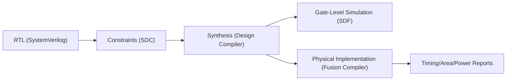
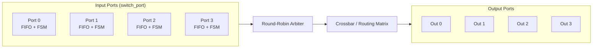
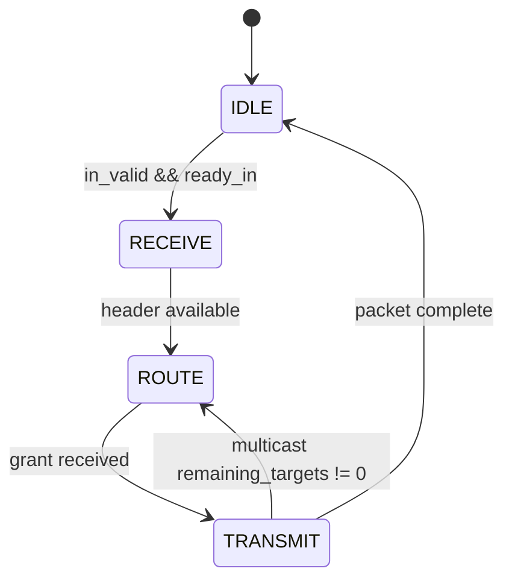
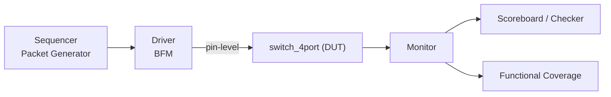
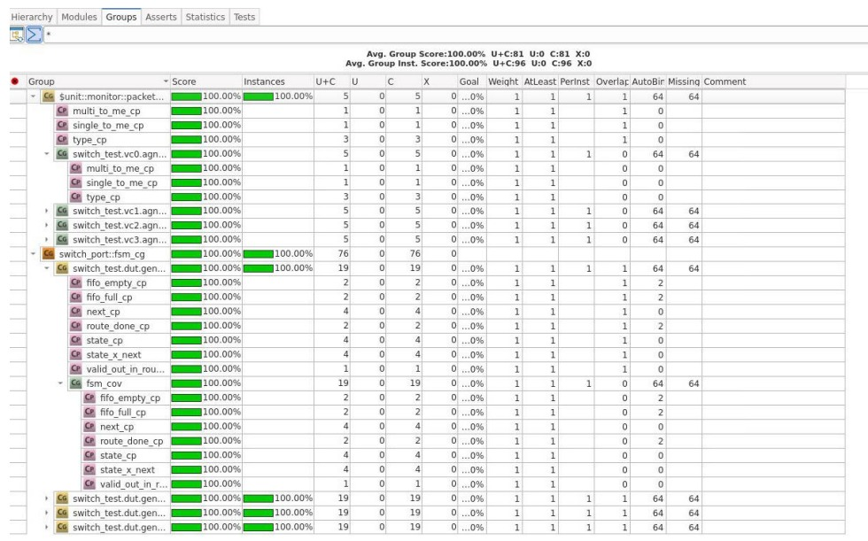
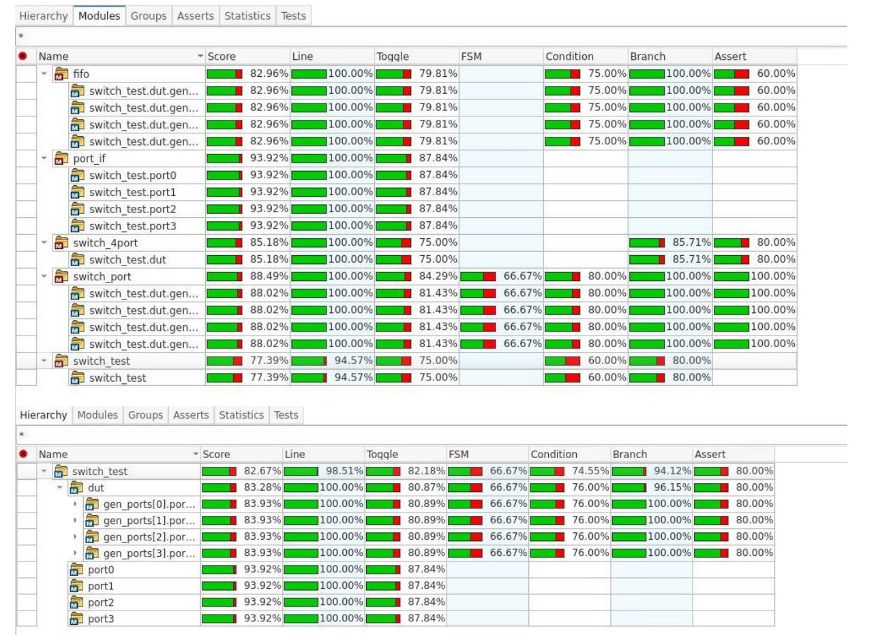
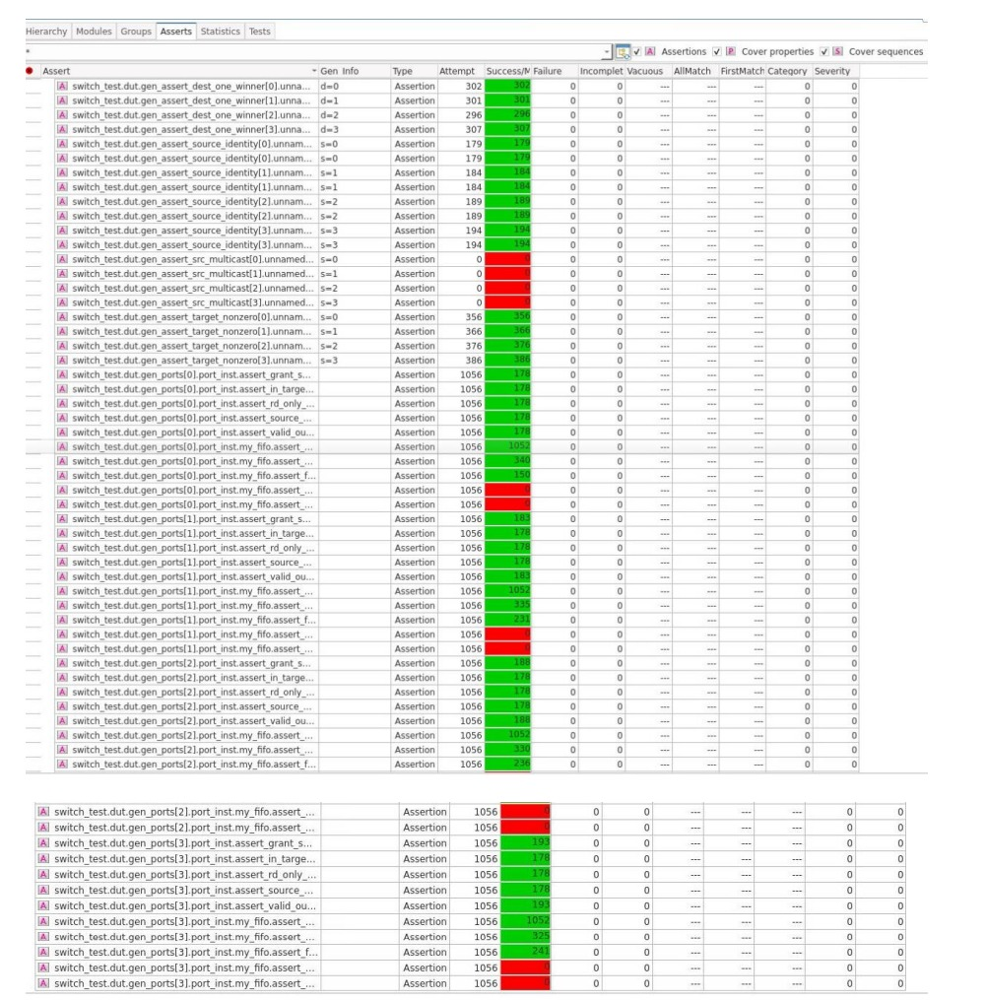

# Four-Port Packet Switch  
### RTL to Gate-Level Implementation (SystemVerilog)

---

## Project Overview

This project implements a complete **4-Port Packet Switch** in SystemVerilog, covering the full ASIC development flow:

- RTL Micro-Architecture Design  
- Constrained-Random Verification (CRV)  
- Assertion-Based Verification (SVA)  
- Functional and Code Coverage Closure  
- Logic Synthesis (Synopsys Design Compiler)  
- Clock Gating Optimization  
- Gate-Level Simulation with SDF Back-Annotation  

The switch routes packets between four ports using a 4-bit destination mask and supports:

- Unicast  
- Multicast  
- Broadcast  

---

## Implementation Flow (RTL → Gates → Physical)



# 1. RTL Architecture

## 1.1 System Architecture

The design follows an **Input-Buffered Switching Architecture**:

- Four independent input ports  
- Per-port synchronous FIFO (Depth = 8, FWFT)  
- Centralized Round-Robin arbitration  
- Non-blocking crossbar routing  
- Hardware backpressure enforcing a strict No-Drop policy  

Each port operates independently while arbitration resolves output contention fairly and deterministically.

## RTL Block Diagram


Control path: input ports assert requests → arbiter generates grants.  
Data path: granted input data is routed through the crossbar to the selected output(s).
---

## 1.2 Port Controller (`switch_port.sv`)

Each input port contains:

### FIFO
- Synchronous First-Word Fall-Through (FWFT) FIFO  
- 16-bit packet width  
- Depth of 8 entries  
- Immediate header visibility for arbitration  

### Flow Control

```systemverilog
ready_in = !fifo_full;
```

- Strict valid/ready handshake  
- Structurally prevents overflow  
- Guarantees zero packet loss  


### Port Controller FSM

The port FSM controls receive, arbitration wait, and transmit (including partial multicast completion).



States:
- `IDLE`
- `RECEIVE`
- `ROUTE`
- `TRANSMIT`

Multicast support is implemented using a dynamic target mask:

```systemverilog
remaining_targets <= remaining_targets & ~grant_in;
```

This enables partial multicast completion without head-of-line blocking.

### Reset Strategy
- Fully synchronous reset  
- Deterministic initialization  

---

## 1.3 Switch Core (`switch_4port.sv`)

### Legality Checking

Combinational logic detects:
- Self-loop packets (`source & target ≠ 0`)  
- Zero-target packets  

Illegal packets are flushed using a synthetic grant mechanism to prevent deadlock.

---

### Arbitration

- One Round-Robin pointer per output port  
- Rotating priority after successful grant  
- Starvation-free under full contention  

Fairness verified under maximum concurrency conditions.

---

### Crossbar Routing

Implemented using `generate` blocks for scalability and synthesis compatibility.

Supports:
- Parallel independent transfers  
- Full-duplex operation  
- Non-blocking behavior for disjoint paths  

---

# 2. Transaction Model (`packet_data.sv`)

Packet structure:

- `source` – 4-bit one-hot encoded  
- `target` – 4-bit routing mask  
- `data` – 8-bit payload  
- `pkt_type` – SINGLE, MULTICAST, BROADCAST  

Features:

- Automatic one-hot encoding (`1 << port_index`)  
- Static packet tagging  
- Built-in protocol constraints  
- Deep-copy support for scoreboard integrity  
- Fully CRV-ready  

---

# 3. Verification Environment (Stage B)

## Verification Environment (Block Diagram)



A modular layered SystemVerilog verification architecture was implemented.

## 3.1 Environment Structure

- Sequencer (weighted constrained-random traffic generation)
- Driver (backpressure-aware protocol engine)
- Monitor (transaction reconstruction)
- Centralized Scoreboard (Delivery-Based Matching)
- Functional coverage
- Embedded SystemVerilog Assertions (SVA)

The structure follows a UVM-ready agent-based hierarchy.

---

## 3.2 Concurrency & Stress Testing

Driver uses a static semaphore:

```systemverilog
static semaphore drive_sem = new(4);
```

This enables all four ports to inject packets in the same clock cycle, generating maximum contention.

---

## 3.3 Scoreboard Strategy

Since multicast packets split into multiple output events:

- Four independent expected queues (one per output port)
- Matching based on `{Source, Data, Target_Bit}`
- Order-independent validation

This guarantees correctness regardless of arbitration reordering.

---

## 3.4 Verification Results

- 488 / 488 transactions matched  
- 0 mismatches  
- 100% Functional Coverage  
- 100% RTL Line Coverage  
- All SVA protocol checks passed

---

### Coverage Evidence

#### Functional Coverage

Functional coverage was implemented using covergroups at the transaction and FSM levels.

Coverage goals included:

- All packet types (SINGLE / MULTICAST / BROADCAST)
- All source ports (0–3)
- All valid target mask combinations
- FIFO empty / full transitions
- All FSM states and transitions
- Arbitration under full contention
- Cross coverage between source × target × packet type

Final Functional Coverage: **100%**



---

#### RTL Code Coverage

RTL code coverage was collected at line and branch level.

Coverage goals included:

- 100% line coverage
- All conditional branches exercised
- All FSM states reached
- All arbitration paths activated
- Illegal packet handling logic exercised

Final RTL Line Coverage: **100%**



---

#### Assertion-Based Verification (SVA)

SystemVerilog Assertions were embedded in the RTL and verification environment to validate protocol correctness and safety properties.

Verified properties included:

- No packet loss
- No data corruption
- Proper valid/ready handshake behavior
- No illegal grant conditions
- Correct reset recovery behavior

All assertions passed during regression.



---

Coverage closure was achieved through iterative refinement of constrained-random scenarios until all coverage bins were exercised.

Verified properties:

- No packet loss  
- No data corruption  
- No starvation  
- Fair arbitration  
- Correct reset recovery  

---

# 4. Synthesis & Physical Analysis (Stage C)

## Fusion Compiler Flow (Physical Implementation)

- Implemented a TCL-based FC run flow (read RTL/netlist, apply SDC, set libraries, compile/optimize).
- Generated timing/area/power reports and reviewed QoR across baseline vs. clock-gated configurations.
- Supported back-annotation and gate-level verification using synthesized netlist + SDF.

Technology: SAED 90nm / 32nm  
Tool: Synopsys Design Compiler  
Target Frequency: 100 MHz  

## Timing Results

| Configuration | Fmax | Worst Setup Slack | Worst Hold Slack |
|--------------|------|------------------|-----------------|
| Baseline | 363 MHz | +7.25 ns | +0.15 ns |
| Clock Gating | 352 MHz | +7.16 ns | +0.05 ns |

All constraints met with positive margins.

## Power & Area Optimization

Clock gating achieved:

- 13.6% area reduction  
- 26% leaf cell reduction  
- 41% combinational logic reduction  
- 64% internal power reduction  
- 41% total power reduction  

Gate-level regression passed with full SDF back-annotation.

---

# 5. Technical Skills Demonstrated

- RTL micro-architecture design  
- FSM implementation  
- Backpressure flow control  
- Arbitration logic design  
- Multicast routing  
- Assertion-based verification  
- Constrained-random methodology  
- Coverage closure  
- Clock gating optimization  
- Timing / Area / Power trade-off analysis  
- Gate-level simulation  

---

# 6. How to Run

## RTL Simulation

```bash
make -f scripts/Makefile comp CUD=scripts/run.f
make -f scripts/Makefile run
make -f scripts/Makefile report
```

## Synthesis

```bash
dc_shell -f scripts/run.tcl
```

## Gate-Level Simulation

```bash
make -f scripts/Makefile clean
make -f scripts/Makefile comp CUD=scripts/build.cud USE_SDF=1
make -f scripts/Makefile run
make -f scripts/Makefile report
```
